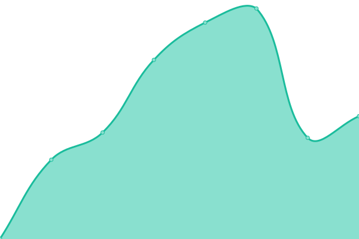
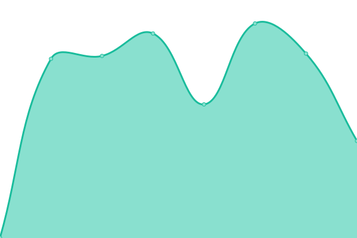
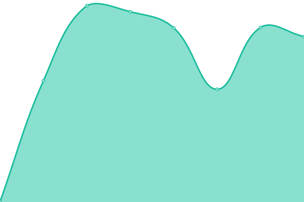
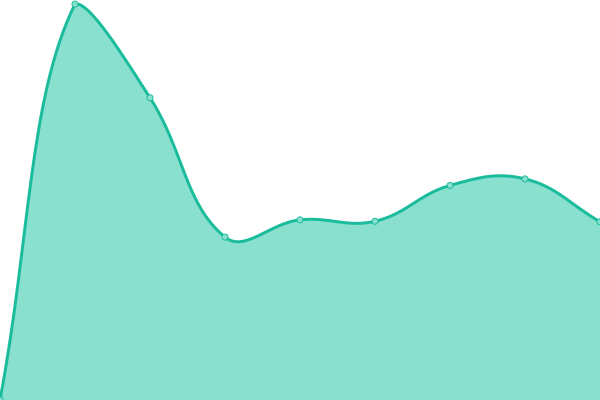
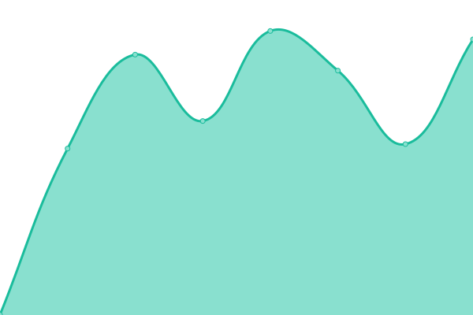
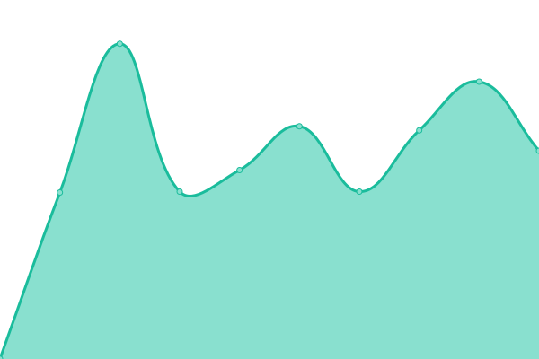

# [📈 Live Status](https://upptime.github.io/upptime): <!--live status--> **🟩 All systems operational**

This repository contains the open-source uptime monitor and status page for [Upptime](https://upptime.js.org), powered by [Upptime](https://github.com/upptime/upptime).

With [Upptime](https://upptime.js.org), you can get your own unlimited and free uptime monitor and status page, powered entirely by a GitHub repository. We use [Issues](https://github.com/upptime/upptime/issues) as incident reports, [Actions](https://github.com/jony4/upptime/actions) as uptime monitors, and [Pages](https://upptime.github.io/upptime) for the status page.

<!--start: status pages-->
<!-- This summary is generated by Upptime (https://github.com/upptime/upptime) -->
<!-- Do not edit this manually, your changes will be overwritten -->
<!-- prettier-ignore -->
| URL | Status | History | Response Time | Uptime |
| --- | ------ | ------- | ------------- | ------ |
|  [ChatGPT 免翻服务](https://chat.jony4.vip/zh) | 🟩 Up | [chat-gpt.yml](https://github.com/jony4/upptime/commits/HEAD/history/chat-gpt.yml) | 

 1249ms
     
 | 

<a href="https://jony4.github.io/upptime/history/chat-gpt">100.00%</a>
    

|  ChatGPT API 免翻服务接口 | 🟩 Up | [chat-gpt-api.yml](https://github.com/jony4/upptime/commits/HEAD/history/chat-gpt-api.yml) | 

 228ms
     
 | 

<a href="https://jony4.github.io/upptime/history/chat-gpt-api">100.00%</a>
    

|  [Photo 照片排版打印](https://zhaopian.jony4.vip) | 🟩 Up | [photo.yml](https://github.com/jony4/upptime/commits/HEAD/history/photo.yml) | 

 1123ms
     
 | 

<a href="https://jony4.github.io/upptime/history/photo">100.00%</a>
    

|  [History 历史长河](https://history.jony4.vip) | 🟩 Up | [history.yml](https://github.com/jony4/upptime/commits/HEAD/history/history.yml) | 

 351ms
     
 | 

<a href="https://jony4.github.io/upptime/history/history">100.00%</a>
    

|  [Wechat MP Editor 微信公众号编辑器](https://editor.jony4.vip) | 🟩 Up | [wechat-mp-editor.yml](https://github.com/jony4/upptime/commits/HEAD/history/wechat-mp-editor.yml) | 

 1117ms
     
 | 

<a href="https://jony4.github.io/upptime/history/wechat-mp-editor">100.00%</a>
    

|  Rss | 🟩 Up | [rss.yml](https://github.com/jony4/upptime/commits/HEAD/history/rss.yml) | 

 1213ms
     
 | 

<a href="https://jony4.github.io/upptime/history/rss">100.00%</a>
    

|  AI Proxy | 🟩 Up | [ai-proxy.yml](https://github.com/jony4/upptime/commits/HEAD/history/ai-proxy.yml) | 

 879ms
     
 | 

<a href="https://jony4.github.io/upptime/history/ai-proxy">100.00%</a>
    

|  Lobechat | 🟩 Up | [lobechat.yml](https://github.com/jony4/upptime/commits/HEAD/history/lobechat.yml) | 

 1268ms
     
 | 

<a href="https://jony4.github.io/upptime/history/lobechat">100.00%</a>
    

|  V2rayA | 🟩 Up | [v2ray-a.yml](https://github.com/jony4/upptime/commits/HEAD/history/v2ray-a.yml) | 

 992ms
     
 | 

<a href="https://jony4.github.io/upptime/history/v2ray-a">100.00%</a>
    

|  clash2sfa | 🟩 Up | [clash2sfa.yml](https://github.com/jony4/upptime/commits/HEAD/history/clash2sfa.yml) | 

 1112ms
     
 | 

<a href="https://jony4.github.io/upptime/history/clash2sfa">100.00%</a>
    

|  dts | 🟩 Up | [dts.yml](https://github.com/jony4/upptime/commits/HEAD/history/dts.yml) | 

 998ms
     
 | 

<a href="https://jony4.github.io/upptime/history/dts">100.00%</a>
    

|  favs | 🟩 Up | [favs.yml](https://github.com/jony4/upptime/commits/HEAD/history/favs.yml) | 

 852ms
     
 | 

<a href="https://jony4.github.io/upptime/history/favs">100.00%</a>
    

<!--end: status pages-->

[**Visit our status website →**](https://upptime.github.io/upptime)

## 📄 License

- Powered by: [Upptime](https://github.com/upptime/upptime)
- Code: [MIT](./LICENSE) © [Anand Chowdhary](https://anandchowdhary.com), supported by [Pabio](https://pabio.com)
- Data in the `./history` directory: [Open Database License](https://opendatacommons.org/licenses/odbl/1-0/)
